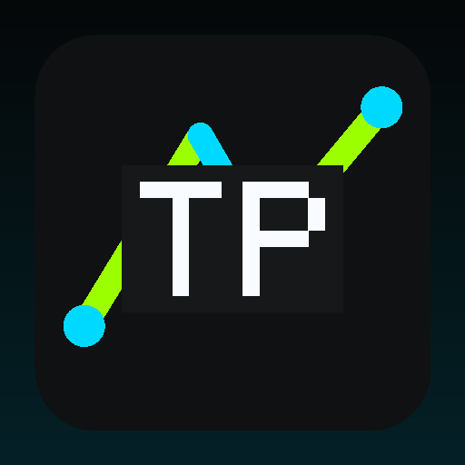

<p align="center"></p>

# Trackb Prod

**Build the World Around the Work.**

An entertainment brand for releases, talent, shows, media, fan discovery, events, and commerce.

> **A media-rich experience that can connect releases, events, editorial, and commerce without repeating one template.**

---

## Overview

Trackb Prod is represented as a complete digital system: brand identity, product architecture, support, documentation, developer experience, trust, resources, policies, and a production-oriented GitHub Pages website.

## Core Capabilities

- **Releases** — Releases is treated as part of the complete Trackb Prod experience — designed to connect the system while keeping the experience clear, useful, and maintainable.
- **Shows** — Shows is treated as part of the complete Trackb Prod experience — designed to connect the system while keeping the experience clear, useful, and maintainable.
- **Media** — Media is treated as part of the complete Trackb Prod experience — designed to connect the system while keeping the experience clear, useful, and maintainable.
- **Community** — Community is treated as part of the complete Trackb Prod experience — designed to clarify the system while keeping the experience clear, useful, and maintainable.
- **Store** — Store is treated as part of the complete Trackb Prod experience — designed to shape the system while keeping the experience clear, useful, and maintainable.

## Operating Principles

- **Culture** — part of the core brand direction.
- **Story** — part of the core brand direction.
- **Audience** — part of the core brand direction.
- **Moment** — part of the core brand direction.

## Website Standard

The website is generated for GitHub Pages with responsive layouts, local branded imagery, accessible navigation, SEO metadata, structured data, search, a sitemap, robots.txt, a web manifest, product pages, developer pages, support infrastructure, trust content, policies, and automated validation.

Website: https://trackb-prod.github.io/

## Support

- Support Center: https://trackb-prod.github.io/support.html
- GitHub: https://github.com/trackb-prod

> Connected-account email addresses are private by default and are never copied into the public website automatically.

## Repository Ecosystem

```text
trackb-prod
trackb-prod.github.io
```

## Brand Assets

- `brand/profile-avatar.png` — 512×512 PNG generated below GitHub's 1 MB profile-picture limit.
- `brand/logo.svg` — scalable brand mark.
- `brand/visual-hero.svg` — local branded hero artwork.
- `brand/brand.json` — machine-readable brand metadata.

## Privacy & Secret Safety

BrandForge V14 runs a publication gate that looks for account-email leakage and common secret patterns before publishing. Provider keys and GitHub credentials belong in secure server-side secrets, not HTML, client-side JavaScript, README files, or public repositories.

## Publishing Standard

Public claims should remain accurate and verifiable. BrandForge does not invent customers, testimonials, awards, certifications, business locations, product inventory, pricing, service guarantees, carrier coverage, uptime, call volume, or social accounts. V14 can generate reserved fictional phone/email placeholders for mockups, but it never publishes them as real contact channels.

---

© 2026 Trackb Prod. All rights reserved.
